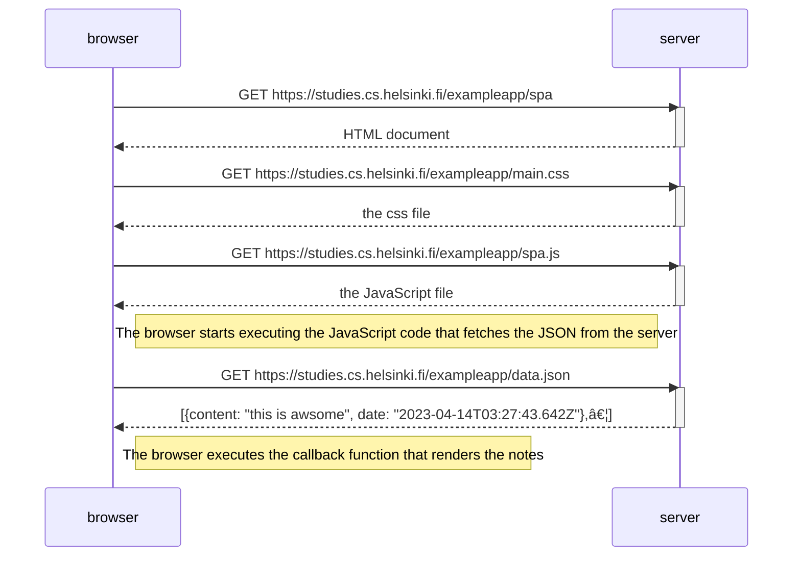

```mermaid
sequenceDiagram
    participant browser
    participant server
    
browser->>server: GET  https://studies.cs.helsinki.fi/exampleapp/spa
    activate server
    server-->>browser: HTML document
    deactivate server
    

    browser->>server: GET https://studies.cs.helsinki.fi/exampleapp/main.css
    activate server
    server-->>browser: the css file
    deactivate server   
 
    browser->>server: GET https://studies.cs.helsinki.fi/exampleapp/spa.js
    activate server
    server-->>browser: the JavaScript file
    deactivate server
    
    Note right of browser: The browser starts executing the JavaScript code that fetches the JSON from the server
    
    browser->>server: GET https://studies.cs.helsinki.fi/exampleapp/data.json
    activate server
    server-->>browser: [{content: "this is awsome", date: "2023-04-14T03:27:43.642Z"},…] 
    deactivate server    

    Note right of browser: The browser executes the callback function that renders the notes 

```

